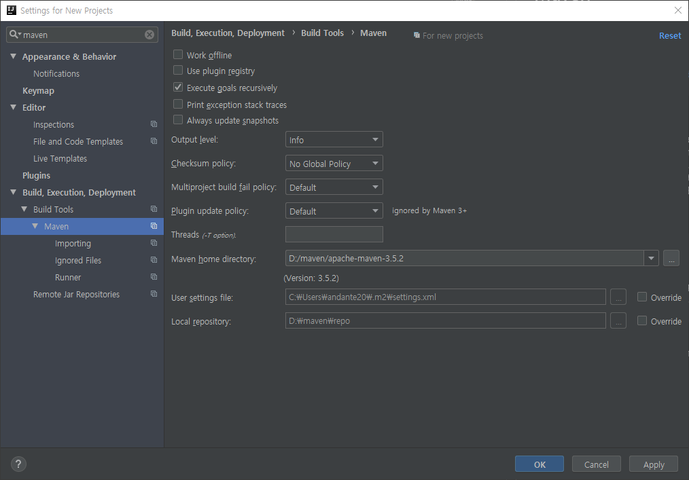

# Maven

### 설치  
* JAVA 설치
* Gow 설치 https://github.com/bmatzelle/gow/releases/download/v0.8.0/Gow-0.8.0.exe

```sh
mkdir d:\opt\maven
cd d:\opt\maven

curl -k -L -o apache-maven-3.5.3-bin.zip http://mirror.apache-kr.org/maven/maven-3/3.5.3/binaries/apache-maven-3.5.3-bin.zip
tar -xzvf apache-maven-3.5.3-bin.zip

setx -m MAVEN_HOME=d:\opt\maven\apache-maven-3.5.3-bin
setx -m PATH=%PATH%;%MAVEN_HOME%\bin;

mvn -version

```

### repository path 변경  
* 기본 : %USERPROFILE%\.m2\repository 
* %MAVEN_HOME%\conf\settings.xml 

```xml
<!-- 주석 해제 후 설정 -->
<localRepository>d:\opt\maven\repo</localRepository>
```

### intellij 
  
