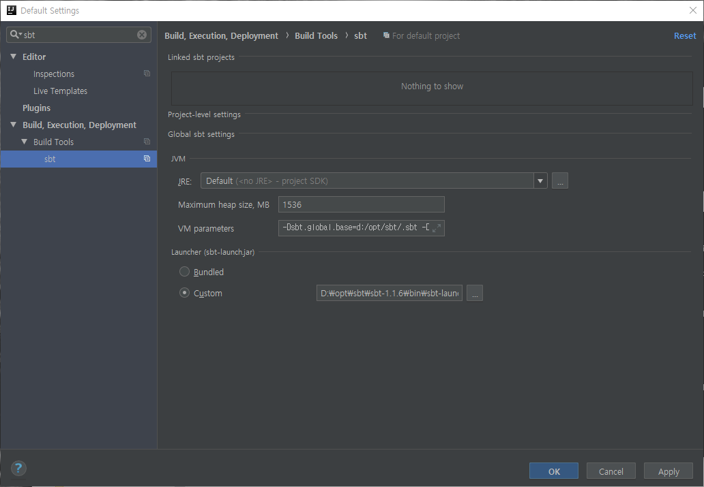
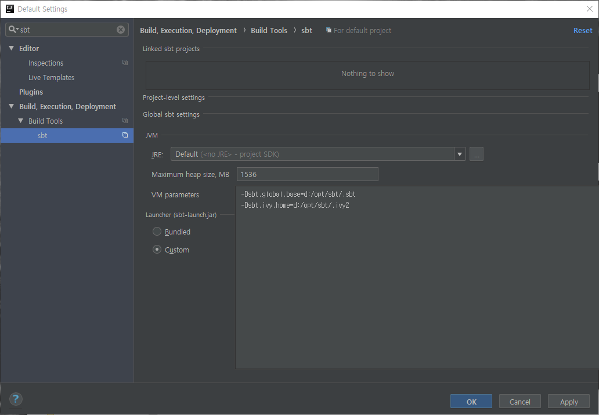

# SBT Scala Build Tool

### 설치
```sh
mkdir d:\opt\sbt
cd d:\opt\sbt

curl -k -L -o sbt-1.1.6.zip https://piccolo.link/sbt-1.1.6.zip
tar -xzvf sbt-1.1.6.zip

setx -m SBT_HOME d:\opt\maven\sbt-1.1.6
setx -m PATH %PATH%;%SBT_HOME%\bin;

sbt
```

### repository path 설정
* 기본 %USERPROFILE%\.sbt, %USERPROFILE%\.ivy2
* %SBT_HOME%\conf\sbtconfig.txt  

  추가  
  ```properties
  -Dsbt.global.base=d:/opt/sbt/.sbt
  -Dsbt.ivy.home=d:/opt/sbt/.ivy2
  ```

### 사용법

[Quick Start](sbt_00.md)


### intelij 설정

